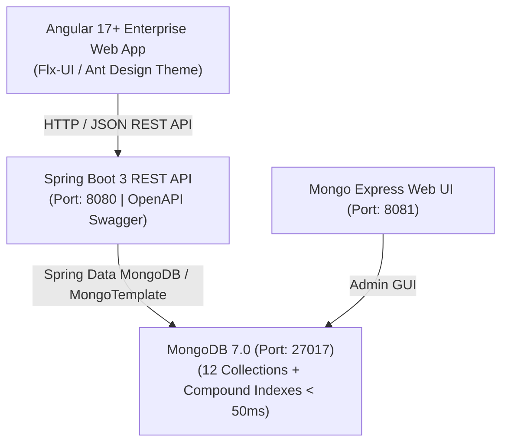

# sWork - Nền tảng Quản lý Công việc & Không gian làm việc

> **Hệ thống sWork** được xây dựng dựa trên:
> 1. **Tài liệu Thiết kế Cơ sở Dữ liệu MongoDB**: 12 collections nghiệp vụ cốt lõi, mô hình phân hệ *Không gian làm việc & Dự án (Projects Space)* và *Công việc cá nhân (My Tasks - 4 tab)*, cùng hệ thống chỉ mục tối ưu hóa tốc độ truy vấn < 50ms khi đạt hàng triệu tasks.
> 2. **Kiến trúc tham khảo từ FIS (FPT Information System)**: Kiến trúc phân tầng chuẩn Enterprise (Controller - Service - Repository - Entity - DTO), chuẩn hóa phản hồi `ApiResponse<T>`, xử lý ngoại lệ tập trung `GlobalExceptionHandler`, Swagger/OpenAPI 3, và hệ thống thiết kế giao diện doanh nghiệp hiện đại.

---

## 🏗️ Kiến trúc Hệ thống (Architecture)



---

## 🗄️ Cấu trúc 12 Collections MongoDB (Khớp 100% Đặc tả)

| STT | Collection | Mục đích sử dụng | Đặc điểm & Chỉ mục (Indexes) |
|---|---|---|---|
| 1 | `users` | Hồ sơ tài khoản, vai trò (`SYSTEM_OWNER`, `ADMIN`, `MEMBER`) | Unique `email: 1`, `department_id: 1` |
| 2 | `departments` | Cơ cấu tổ chức & cây phòng ban | Unique `code: 1`, `parent_id: 1` |
| 3 | `projects` | Quản lý dự án, tiến độ %, thành viên, stages, settings | Unique `code: 1`, `members.user_id: 1`, `department_id: 1` |
| 4 | `tasks` | **Xương sống hệ thống**: Checklist, phân công, 4 tab My Tasks, dependencies, review gate | Unique `task_key: 1`, `{project.id, stage_id, status}`, `{assignee.user_id, status}`, `due_date`, Text search `{title, task_key}` |
| 5 | `worklogs` | Chấm công, nhật ký làm việc chi tiết | `{user_id: 1, work_date: -1}`, `{project_id: 1, work_date: -1}` |
| 6 | `calendar_events` | Lịch cá nhân, lịch họp, sự kiện công việc | `{user_id: 1, start_time: 1}` |
| 7 | `personal_plans` | Kế hoạch làm việc theo ngày/tuần/tháng | `{user_id: 1, start_date: -1}` |
| 8 | `recurring_tasks` | Cấu hình công việc tự động lặp lại theo chu kỳ (Cron) | `{is_active: 1, next_run_at: 1}` |
| 9 | `notifications` | Lưu trữ và xử lý chuông báo hệ thống | `{user_id: 1, is_read: 1, created_at: -1}` |
| 10 | `project_discussions` | Tin nhắn, trao đổi, đính kèm trong tab Thảo luận dự án | `{project_id: 1, created_at: -1}` |
| 11 | `project_documents` | Quản lý tập tin, tài liệu đính kèm dự án | `{project_id: 1, uploaded_at: -1}` |
| 12 | `project_goals` | Mục tiêu và chỉ số đánh giá OKRs dự án | `{project_id: 1}` |
| - | `activity_logs` | Nhật ký hành vi kiểm toán hệ thống | `{target_id: 1, created_at: -1}` |

---

## 🌟 Các Phân hệ Chức năng Chính

### 1. Phân hệ Công việc cá nhân (My Tasks)
Lọc đa chiều theo 4 vai trò đặc thù của người dùng:
- **Tôi thực hiện** (`assignee.user_id = current_user`)
- **Tôi phối hợp** (`collaborator_ids contains current_user`)
- **Tôi giao** (`creator_id = current_user`)
- **Tôi theo dõi** (`follower_ids contains current_user`)

### 2. Phân hệ Không gian làm việc & Dự án (Projects Space)
- **Kanban Stages**: Gom nhóm công việc theo giai đoạn (*Khảo sát & thiết kế*, *Phát triển*, *Kiểm thử*, *Nghiệm thu*).
- **Thống kê tiến độ tự động**: Tự động tính toán lại tỷ lệ hoàn thành `%`, số task completed/in_progress/todo mỗi khi cập nhật trạng thái.
- **Phụ thuộc công việc (Dependencies)**: Hỗ trợ `blocked_by` và `blocking` với các loại liên kết (`FINISH_TO_START`, `START_TO_FINISH`).
- **Phê duyệt công việc (Review Gate)**: Thiết lập bắt buộc duyệt trước khi chuyển `DONE`.
- **Cấu hình dự án (Settings)**: Đầy đủ các thiết lập cơ bản (`basic_settings`), hệ thống (`system_settings`), nâng cao (`task_advanced_settings`) và định nghĩa trường tùy chỉnh (`custom_field_definitions`).

### 3. Phân hệ Nhật ký chấm giờ (Worklogs)
- Ghi nhận thời gian thực hiện theo từng task.
- Tự động tích lũy và cập nhật `estimation.spent_hours` của Task.

---

## 🚀 Hướng dẫn Cài đặt & Khởi chạy (Quick Start)

### Yêu cầu môi trường
- Java 17 LTS trở lên
- Apache Maven 3.8+
- Node.js 18+ & npm
- Docker & Docker Compose

### Bước 1: Khởi động MongoDB & Mongo-Express
```bash
docker-compose up -d
```
- MongoDB sẽ chạy tại cổng: `localhost:27017`
- Web giao diện quản trị Mongo Express: `http://localhost:8081` (Tài khoản/Mật khẩu mặc định: `root / secretpassword`)
- Script `docker/mongo-init/init-indexes.js` sẽ tự động tạo sẵn toàn bộ 12 collections và các compound index.

### Bước 2: Chạy Backend Spring Boot
```bash
cd backend
mvn spring-boot:run
```
- Backend REST API khởi chạy tại: `http://localhost:8080`
- Swagger UI tài liệu API tương tác: **[http://localhost:8080/swagger-ui/index.html](http://localhost:8080/swagger-ui/index.html)**
- *Lưu ý: `DataSeeder.java` sẽ tự động nạp sẵn dữ liệu mẫu thực tế (Người dùng Nguyễn Lan, Dự án WEB, các tasks WEB-101 đến WEB-108, checklists, worklogs).*

### Bước 3: Cấu trúc & Khởi chạy Frontend
Thư mục `frontend/` được chuẩn hóa theo đúng mô hình kiến trúc chuẩn của FIS:
- **`frontend/front-end`**: Front-end Root Portal (Single-SPA port 9000, cung cấp `flx-ui`, `khaos-service`, `sdk-common` tại `dist/npm/`).
- **`frontend/stasks`**: Micro-frontend sWork Tasks độc lập.
  - Sử dụng các package dùng chung qua đường dẫn chuẩn: `file:../front-end/dist/npm/...`.
  - Khi cần bàn giao hoặc tích hợp vào hệ thống FIS thực tế, chỉ cần chuyển thư mục `stasks` vào `fis/frontend/stasks` là hoạt động ngay lập tức mà không cần sửa code.

```bash
cd frontend/stasks
npm start
```
- Module sWork Tasks khởi chạy tại: **[http://localhost:4250](http://localhost:4250)**.
- Khi FE Root hoạt động, cổng tổng **[http://localhost:9000/swork](http://localhost:9000/swork)** sẽ định tuyến tự động vào module này.

---

## 📡 Danh mục REST API (Swagger OpenAPI)

| Phương thức | Endpoint | Mô tả |
|---|---|---|
| `GET` | `/api/v1/tasks` | Lọc công việc theo 4 tab My Tasks (`tab=ASSIGNED/COLLABORATING/CREATED/FOLLOWING`), status, search |
| `POST` | `/api/v1/tasks` | Tạo mới công việc (tự sinh mã `WEB-xxx`) |
| `PUT` | `/api/v1/tasks/{id}` | Cập nhật chi tiết công việc |
| `PATCH` | `/api/v1/tasks/{id}/status` | Đổi nhanh trạng thái công việc (`TODO`, `IN_PROGRESS`, `DONE`, v.v.) |
| `PATCH` | `/api/v1/tasks/{id}/checklists/{checkItemId}` | Đánh dấu hoàn tất mục checklist |
| `GET` | `/api/v1/projects` | Danh sách dự án & chỉ số tiến độ % |
| `GET` | `/api/v1/projects/{id}` | Chi tiết dự án, thành viên, stages, settings |
| `PUT` | `/api/v1/projects/{id}/settings` | Cập nhật cấu hình cài đặt dự án |
| `POST` | `/api/v1/worklogs` | Chấm giờ công việc & tự động cập nhật số giờ đã làm |
| `GET` | `/api/v1/worklogs/task/{taskId}` | Lịch sử chấm giờ theo công việc |
| `GET` | `/api/v1/users` | Danh bạ tài khoản người dùng hệ thống |
| `GET` | `/api/v1/departments` | Cơ cấu phòng ban tổ chức |
